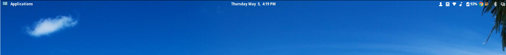
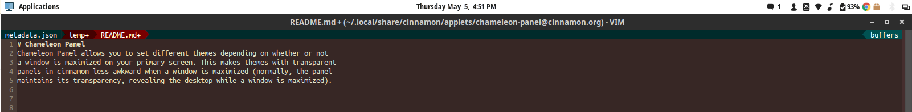

# Chameleon Panel
Chameleon Panel allows you to set different themes depending on whether or not
a window is maximized on your primary screen. This makes themes with transparent
panels in cinnamon less awkward when a window is maximized (normally, the panel
maintains its transparency, revealing the desktop while a window is maximized).





## Configuration / Installation
In `~/.local/share/cinnamon/applets/`, do
```sh
git clone https://github.com/patgrasso/chameleon-panel.git cinnamon-panel@cinnamon.org
```
In the `metadata.json` file, two attributes are listed as `null`.

`theme-light` should contain the absolute path to the css file of the ordinary
theme.
`theme-dark` should contain the absolute path to the css file of the theme which
should appear whenever a window is maximized on the primary screen.
